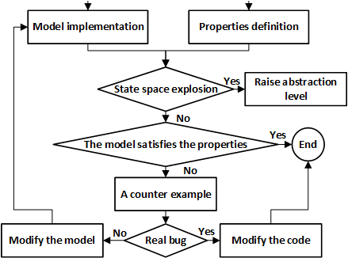

# Model_Checking_of_Hyperledger_Fabric_Smart_Contracts
## Overview
Conducting interactions between shared-purpose organizations without centralized oversight is an idea that emerged with the advent of private blockchains such as Hyperledger Fabric and its smart contracts. It is critical to check contracts to ensure their proper functionality, as organizations may collaborate with competitors. To formally verify the source code of contracts, we mapped Fabric contract concepts into the Rebeca modeling language. Rebeca is an actor-based language that enables the modeling of concurrent and distributed systems and is supported by the Afra tool. To perform model checking, we first mapped contract concepts to Rebeca and constructed a contract model. The desired properties are also defined. We removed the code details to avoid exploding state space while preserving the logic of the contract. The tool then analyzes whether the model satisfies the properties. If the model violates a property, the tool provides a counterexample. The modelers must determine if the bug occurs in the contract or if the model was incorrectly created. If a bug occurs, it must be reported to the developer to modify the contract code. Otherwise, the modelers must create a better model.

## Model Checking Approach Architecture

  

## Requirements
- Install [Afra 3](https://www.python.org/downloads)

you can learn about Rebeca from its [User Manual](docs%2user_manual.pdf) and find some Rebeca model examples [Here](https://rebeca-lang.org/Rebeca)

